# HarmonyOS篇

## 安装DevEcoStudio

### 下载 DevEco Studio

[DevEco Studio](https://developer.harmonyos.com/cn/develop/deveco-studio/#download)

### 配置开发环境

选择要安装的Node.js和Ohpm位置，其中ohpm是Open Harmony Package Management的缩写，也就是类似npm的包管理工具。这里有几点注意事项：

- 如果电脑上已经有Node.js，但是版本不一致，建议选择让工具重新安装
- 如果电脑上已经有Node.js，并且版本一致，可以选择Local，指定node目录即可
- 如果电脑上对Node.js做了一些特殊的options配置，建议先移除
- 配置目录中不要出现中文、特殊字符，建议用默认路径

> 同样注意不要出现中文和特殊字符

### 环境错误处理

在安装的过程中，如果出现类似下面的错误：

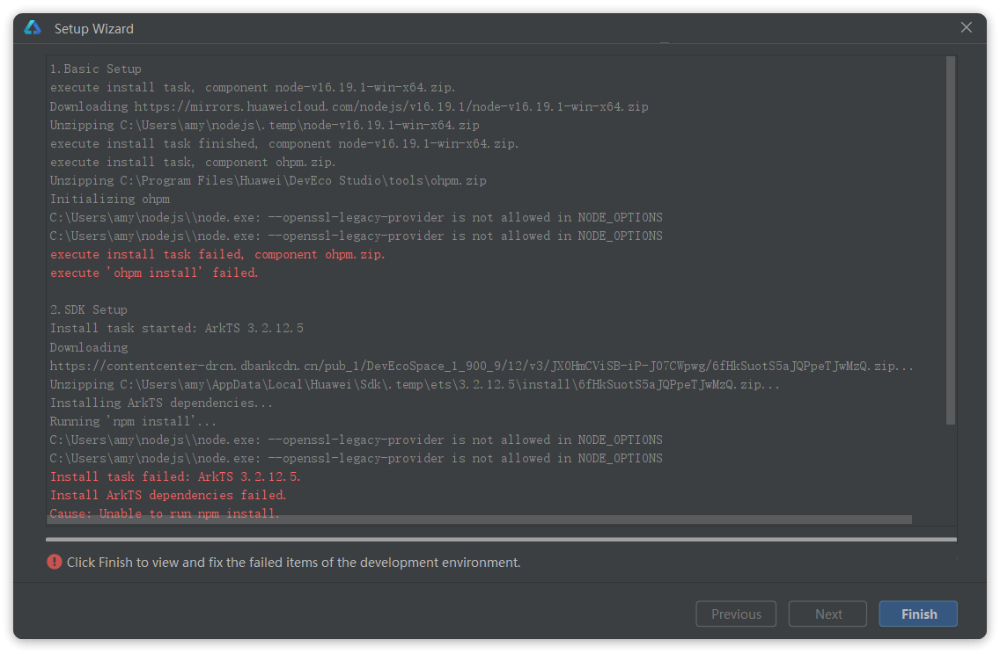

一般就是因为你本地原本的Node.js配置异常导致的，建议清理环境变量中对于Node.js的配置之后再重试。

重试时**无需重新安装**，而是再次打开DevEco Studio，点击界面左下方的**`?`**按钮：

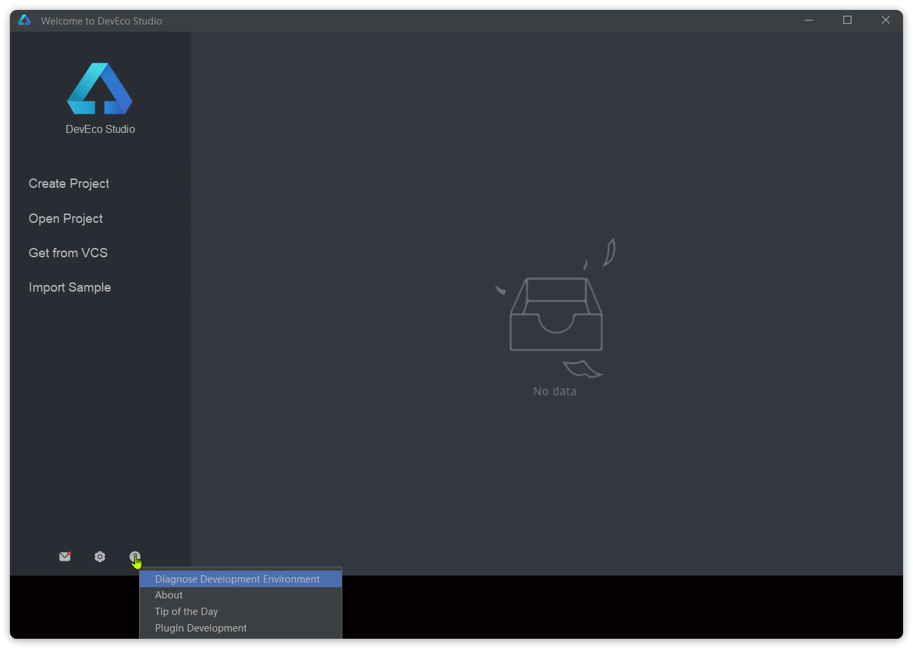

选择Diagnose Development Environment，即诊断开发环境选项，会进入诊断页面：

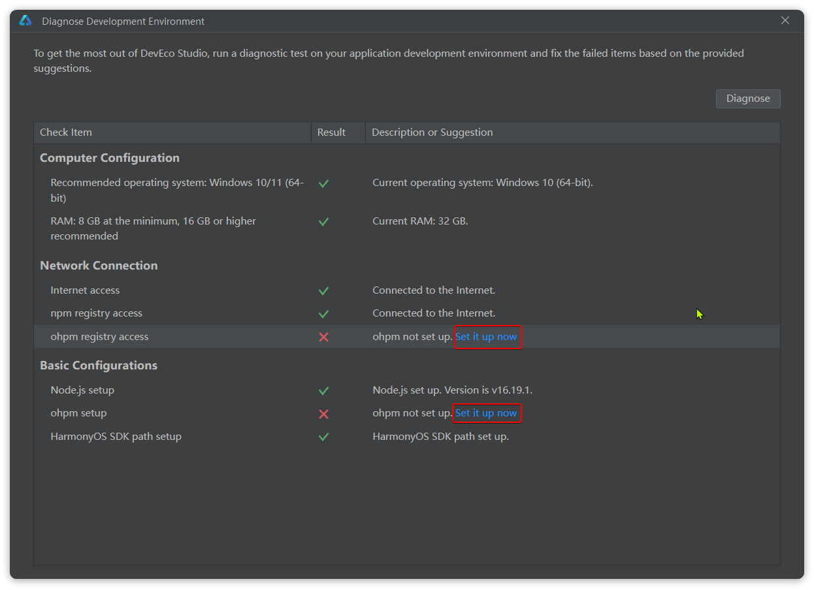

这里会提示安装出现问题的选项，点击异常项后面的set it up now即可重新安装。

如果所有问题都已经解决，最终重试后等待所有项都是 √ 即可：

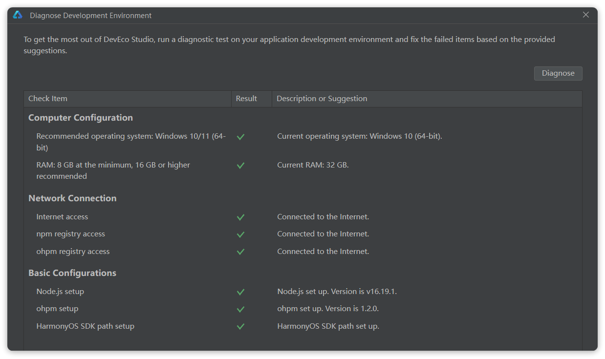

### 简单示例：Hello World

- 需要先创建一个Project

- 然后进入创建应用页面，选择应用模板中的`Empty Ability`模板

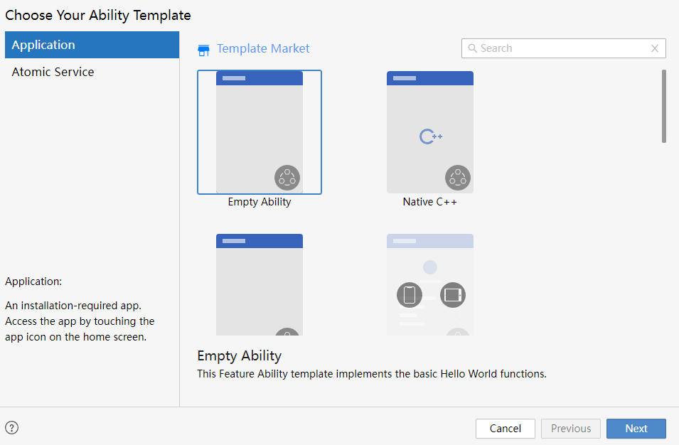

- 填写项目信息，其中Project name、Bundle name、Save location都可以自定义

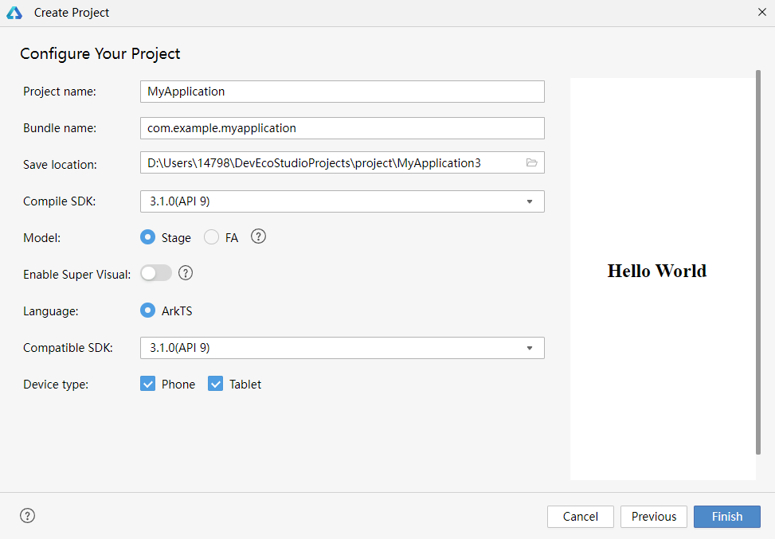

点击Finish完成创建。

### 应用预览

创建好的应用中已经有了基础代码，以后开发后可以直接在工具中预览页面样式。如图。

点击右侧的previewer选项卡，即可看到预览效果：

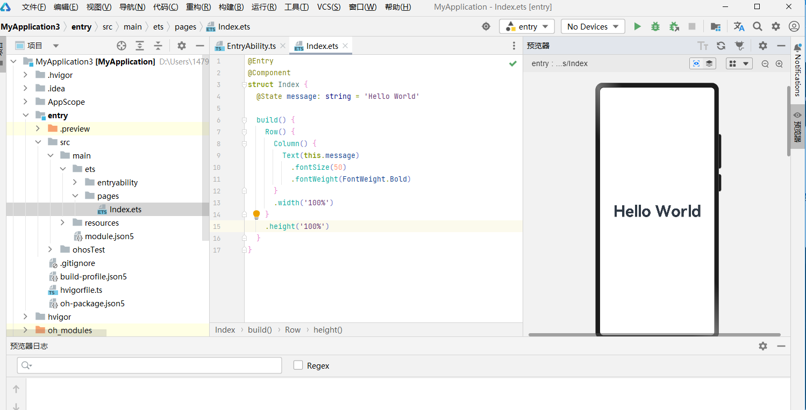

### 安装模拟器

也可以利用设备模拟器来查看更真实的效果。不过需要先配置模拟器。

首先，选择主菜单中的Tools，找到其中的Device Manager，即设备管理：

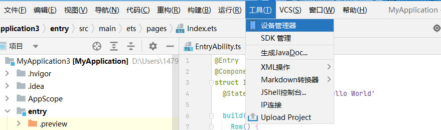

设备可以是`远端设备`，也可以是`本地设备`，以本地设备为例。

默认本地没有任何设备，选择install来安装一个：

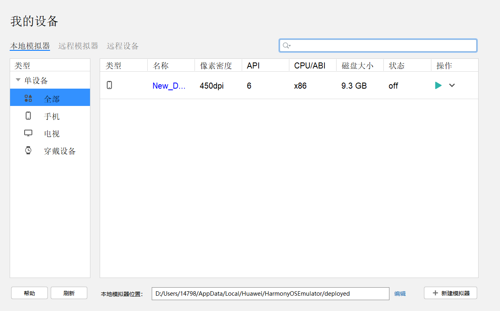

创建完成后，在设备列表中会出现一个本地设备，点击后面的运行按钮即可启动设备模拟器。

然后，在应用启动位置选择刚刚添加的模拟器。

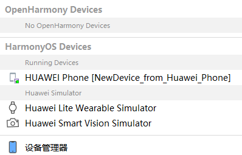

点击启动，可以将应用部署到模拟器。

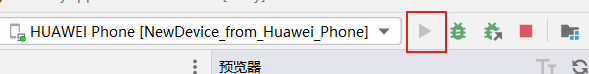

## ArkTS语言

### TypeScript 基本语法

#### 变量声明

- 定义变量

```typescript
let s: string = 'hello wrold'
```

- 不确定类型

```typescript
let a:any = '不确定类型，可能是任意类型'
```

> let a:any = '不确定类型，可能是任意类型'

- 联合类型

```typescript
let u:string|number|boolean = '联合类型，可能是其中一种'
```

- Object：对象类型

```typescript
let car = {brand:'问界',Price:199999}
console.log(car.brand)
console.log(car['brand'])
```

- Array：数组

```typescript
let cars: Array<string> = ['问界','阿维塔']
let price: number[] = [199999,299999]
console.log(cars[0])
console.log(price[1])
```

#### 条件语句

- if和else

```typescript
if(num){}else{}
```

在TypeScript中，空字符串、数字0、null、undefined都被认为是false，其它值则为true。

- switch

```typescript
let season:string = '冬天'
switch(season){
	case '春天':{
		console.log('你的笑容那么美，恰好与春风撞了个满怀')
		break
	}
	case '夏天':{
		console.log('玫瑰到了花期，我很想你')
		break
	}
	case '秋天':{
		console.log('盛夏欠你的温柔，让秋风徐徐来还。')
		break
	}
	default{
		console.log('情话是学的，但爱你是真的')
		break
	}
}
```

#### 循环控制

- for

```typescript
//for
for(let i = 0;i<100;i++){
	console.log('拥有'+i+'个男（女）模对象')
}
```

- for - in

```typescript
// for-in
let cars: string[] = ['问界','阿维塔']
for(const i in cars){
	console.log(cars[i])
}
```

- for - of

```typescript
//for-of
for(const car of cars){
	console.log(car)
}
```

- while

```typescript
//while
let i = 1;
while(i <= 100){
	console.log('拥有'+i+'个男（女）模对象')
	i++;
}
```

#### 函数

- 无返回值

```typescript
function func1(car:string):void{
	console.log(car)
}
fun1('1')
```

- 有返回值

```typescript
function func2(x: number,y:number):number{
	return x+y 
}
let count = func2(1,1)
console.log(1+1='+count)
```

- 简写版，箭头函数

```typescript
let func3 = (car:string) => {
	console.log(car)
}
func3('2')
```

- 函数可选参数

```typescript
function func4(car?:string){
	car = car?car:'胡桃'
	console.log(car)
}
func4()
func4('18')
```

- 函数可选参数，提供默认值

```type
function func5(car:string='胡桃'){
	console.log(car)
}
func5()
func5('18')
```

#### 类和接口

- 定义枚举

```typescript
enum TestConsole{
	A:1,
	B:2,
	C:3
}
```

- 定义接口，抽象方法接受枚举参数

```typescript
interface F{
	//类和对象里的函数不需要加function
	show(price:TestConsole):void
}
```

- 实现接口

```typescript
class S implements F{
	show(res:TestConsole):void{
		console.log('test'+res)
	}
}
```

- 初始化对象

```typescript
let p:F = new S()
//调用方法，传递枚举参数
p.show(TestConsole.A)
```

- 定义构造参数、成员方法

```typescript
//父类
class Rectangle{
	//成员变量
	private width:number
	private length:number
	//构造函数
	constructor(width:number,length:number){
		this.width=width
		this.length=length
	}
	//成员方法
	public area():number{
		return this.width * this.length
	}
}
//子类
class Square extends Rectangle{
	constructor(side:number){
		//调用父类构造
		super(side,side)
	}
}

let s = new Square(10)
console.log(s.area())
```

#### 模块开发

通用功能抽取到单独的ts文件，每个文件都是一个模块(module)。
模块可以相互加载，提高代码复用性。

````typescript
//rectangle.ts
//定义类，通过export导出
export class Rectangle{
	//成员变量
	private width:number
	private length:number
	//构造函数
	constructor(width:number,length:number){
		this.width=width
		this.length=length
	}
}
//定义工具方法，通过export导出
export function area(rec:Rectangle):number{
	return rec.width * rec.length
}
````

````typescript
//index.ts
//通过import导入，from后面写文件的地址
import {Rectangle,area} from '../rectangle'

//创建Rectangle对象
let r = new Rectangle(10,10)

//调用area方法
console.log('面积为：'+area(r))
````

### 第一个简单应用和示例

#### 创建工程


#### Index.ets文件解读

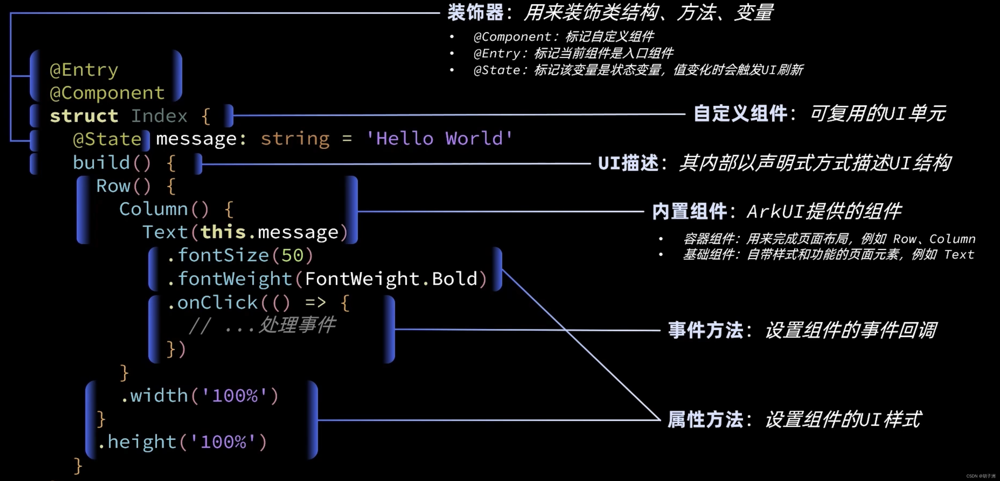

```typescript
@Entry
@Component
struct Index {
  @State message: string = 'Hello World'

  build() {
    Row() {
      Column() {
        Text(this.message)
          .fontSize(50)
          .fontWeight(FontWeight.Bold)
          .onClick(()=>{
            //...处理事件
            if (this.message == 'Hello World') {
 				this.message = '你好 世界'
            }else {
            	this.message = 'Hello World'
            }

          })
      }
      .width('100%')
    }
    .height('100%')
  }
}
```

### ArkUI 组件

#### Image组件

##### 声明Image组件并设置图片源

```arkts
Image(src: string|PixelMap|Resource)
```

- string格式，通常用来加载网络图片，需要申请网络访问权限【`ohos.permission.INTERNET`】


```arkts
Image('https://xxx . png' )
```

在`moudle.json5`配置文件下，配置对应权限

```json
"requestPermissions": [
    {
        "name": "ohos.permission.INTERNET",
        "usedScene": {
            "when": "always"
        }
    }
]
```

- PixelMap格式，可以加载像素图，常用在图片编辑中

```arkts
Image(PixelMapObeject)
```

- Resource格式，加载本地图片，推荐使用

```arkts
Image($r('app.media.mate60'))
Image($rawfile('mate60.png'))
```

> `app.`是默认的写法，这是因为编译后的资源文件在这个目录下。

##### 添加图片属性

```arkts
Image($r('app.media.icon'))
	.width(100) //宽度
	.height(120) //高度
	.borderRadius(10) // 边框圆角
	.interpolation(ImageInterpolation.High) // 图片插值
```

#### Text

##### 声明Text组件并设置文本内容

```arkts
Text(content?:string|Resource)
```

- string格式，直接填写文本内容

```arkts
Text('今天天气很好呀，胡桃！')
```

- Resource格式，读取本地资源文件

```arkts
Text($r('app.string.hello'))
```

##### 添加文本属性

```arkts
Text('注册账号')
	.lineHeight(32) // 行高
	.fontSize(20) // 字体大小
	.fontColor('#ff1876f8') // 字体颜色
	.fontWeight(FontWeight.Medium) // 字体粗细
```

#### TextInput

##### 声明TextInput组件

```arkts
TextInput( {placeholder?: ResourceStr,text?: ResourceStr})
```

- placeHoder：输入框无输入时的提示文本

```arkts
TextInput([placeholder:'请输入账号或手机号'})
```

- text: 输入框当前的文本内容


```arkts
TextInput({text: '1234567890'})
```

##### 添加属性和事件

```arkts
TextInput({text:当前输入文本)
	.width(150) //宽
	.height(30) // 高
	.backgroundColor('#FFF') // 背景色
	.type(InputType.Password)//输入框类型
	.onChange(value=>{
		//value是用户输入的文本内容
	})
```

| 名称          | 描述                                                       |
| ------------- | ---------------------------------------------------------- |
| Normal        | 基本输入模式。支持输入数字、字母、下划线、空格、特殊字符。 |
| Password      | 密码输入模式。支持输入数字、字母、下划线、空格、特殊字符。 |
| Email         | 邮箱地址输入模式。支持数字，字母，下划线，以及@字符。      |
| Number        | 纯数字输入模式。                                           |
| PhoneNumber9+ | 电话号码输入模式。支持输入数字、+、-、*、＃，长度不限。    |

#### Button

##### 声明Button组件，label是按钮文字

```arkts
Button(label?:ResourceStr)
```

- 文字型按钮

```arkts
Button('点我')
```

- 自定义按钮，在Button内嵌套其它组件

```arkts
Button(){
	Image($r('app.media.search')).width(20).margin(10)
}
```

##### 添加属性和事件

```arkts
Button('点我')
	.width(100)
	.height(30)
	.type(ButtonType.Normal)//按钮类型
	.onclick(()=>{
		//处理点击事件
	})
```

#### Slider

##### 声明Slider滑动条组件

```arkts
Slider(options?:SliderOptions)
```

##### 添加属性和事件

```arkts
Slider({
	min:0,//最小值
	max:100,//最大值
	value:30,//当前值
	step:10,//滑动步长
	style:SliderStyle.OutSet,//Inset
	direction:Axis.Horizontal,//Vertical
	reverse:false//是否反向滑动
})
	.width('90%')
	.showTips(true)//是否展示value百分比提示
	.blockColor('#36D')
	.onChangge(value=>{
		//value就是当前滑块值
	})
```

#### Column和Row

##### 属性方法

| 属性方法名     | 说明                             | 参数                              |
| -------------- | -------------------------------- | --------------------------------- |
| justifyContent | 设置子元素在主轴方向的对其格式   | FlexAlign枚举                     |
| alignItems     | 设置子元素在交叉轴方向的对其格式 | Row容器使用VerticalAlign枚举      |
| alignItems     | 设置子元素在交叉轴方向的对其格式 | Column容器使用HorizontalAlign枚举 |

##### FlexAlign枚举

```arkts
FlexAlign枚举:
	FlexAlign.Start
	FlexAlign.Center
	FlexAlign.End
	FlexAlign.SpaceBetween
	FlexAlign.SpaceAround
	FlexAlign.SpaceEvenly
```

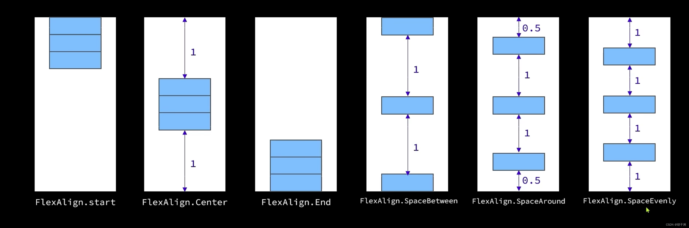

##### HorizontalAlign枚举

```arkts
HorizontalAlign枚举：
	HorizontalAlign.Start
	HorizontalAlign.Center
	HorizontalAlign.End
```

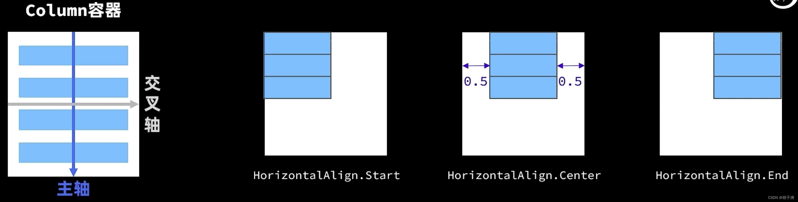

##### VerticalAlign枚举

```arkts
VerticalAlign枚举：
	VerticalAlign.start
	VerticalAlign.Center
	VerticalAlign.End
```

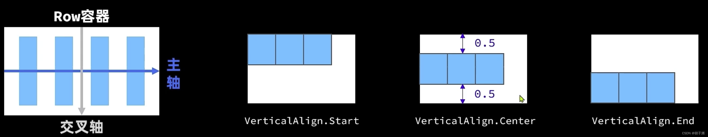

#### 循环控制

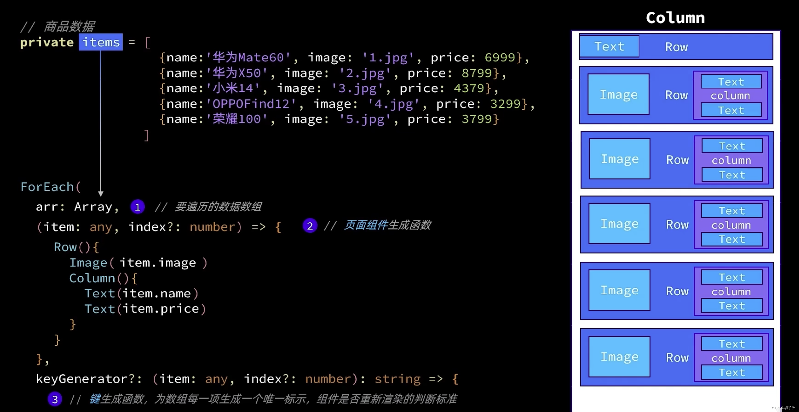

```arkts
class Item {
  name: string
  image: ResourceStr
  price: number
  discount: number

  constructor(name: string, image: ResourceStr, price: number, discount: number = 0) {
    this.name = name
    this.image = image
    this.price = price
    this.discount = discount
  }
}

@Entry
@Component
struct Index {
  private items: Array<Item> = [
    new Item('华为 Meta60', $r('app.media.icon'), 4300, 500),
    new Item('华为 Meta61', $r('app.media.icon'), 4301),
    new Item('华为 Meta62', $r('app.media.icon'), 4302),
    new Item('华为 Meta63', $r('app.media.icon'), 4303)
  ]

  build() {
    Column({ space: 8 }) {
      Row() {
        Text('商品列表')
          .fontSize(30)
          .fontWeight(FontWeight.Bold)
      }.width("100%")
      .margin({ bottom: 20 })

      ForEach(this.items, (item: Item) => {
        Row({ space: 10 }) {
          Image(item.image)
            .width(100)
          Column({ space: 4 }) {
            Text(item.name)
              .fontSize(20)
              .fontWeight(FontWeight.Bold)
            if(item.discount){

              Text('$' + item.price)
                .fontColor('#FFF')
                .fontSize(18)

              Text('$' + item.discount)
                .fontColor('#FFF')
                .fontSize(18)
            }else{
              Text('$' + item.price)
                .fontColor('#FFF')
                .fontSize(18)
            }

          }
          .width("100%")
          .alignItems(HorizontalAlign.Start)
        }.width("90%")
        .backgroundColor("#36d")
        .borderRadius(20)
      })
    }
  }
}
```

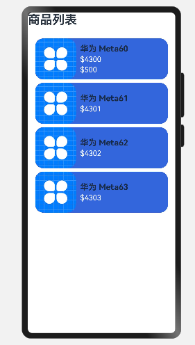

#### List

**列表(List)是一种复杂容器，具备以下特点：**

- 列表项(ListItem)数量过多超出屏幕后，会自动提供滚动功能
- 列表项(ListItem)既可以纵向排列，也可以横向排列

```arkts
List({space:10}){
  ForEach([1,2,3,4],item => {
    ListItem(){
      //列表项内容，只能包含一个根组件
      Text('ListItem')
    }
  })
}
.width('100%')
.layoutWeight(1) // 权重
```

#### 自定义组件

##### @Component

- 在`src/main/ets`下创建components目录，并创建`CommonComponents.ets`文件，创建结构体`Header`，然后使用`export`，用于其他文件可以导入当前结构体模块。

```arkts
@Component
export struct Header{

  private title: ResourceStr

  build(){
    Row() {
      Text('返回')
        .fontSize(30)
        .fontWeight(FontWeight.Bold)
      Text(this.title)
        .fontSize(30)
        .fontWeight(FontWeight.Bold)
      Blank()
      Text('刷新')
        .fontSize(30)
        .fontWeight(FontWeight.Bold)
    }.width("100%")
    .height(30)
  }
}
```

- 使用`import`导入模块

```arkts
import { Header } from '../components/CommonComponents'

@Entry
@Component
struct Index {
  build() {
    Column({ space: 8 }) {

      Header({ title: '商品列表' })
        .margin({ bottom: 20 })
        .backgroundColor('#36D')
    }
  }
}
```

##### @Builder

###### 全局自定义函数

使用@Builder自定义构建函数

```arkts
@Builder function ItemCard(item: Item){
  Row({ space: 10 }) {
    Image(item.image)
      .width(100)
    Column({ space: 4 }) {
      Text(item.name)
        .fontSize(20)
        .fontWeight(FontWeight.Bold)
      if(item.discount){

        Text('$' + item.price)
          .fontColor('#FFF')
          .fontSize(18)

        Text('$' + item.discount)
          .fontColor('#FFF')
          .fontSize(18)
      }else{
        Text('$' + item.price)
          .fontColor('#FFF')
          .fontSize(18)
      }

    }
    .width("100%")
    .alignItems(HorizontalAlign.Start)
  }.width("90%")
  .backgroundColor("#36d")
  .borderRadius(20)
}
```

使用自定义函数`ItemCard`

```arkts
List({ space: 8 }){
    ForEach(this.items, (item: Item) => {
        ListItem(){
        	ItemCard(item)
        }
    })
}.width("100%")
.layoutWeight(1)
```

###### 局部自定义函数

与上面有些区别，首先函数不需要`function`关键字，使用函数需要使用`this`调用。

```arkts
@Builder ItemCard(item: Item){}

ForEach(this.items, (item: Item) => {
    ListItem(){
    	this.ItemCard(item)
    }
})
```

##### @Styles

自定义样式，但是是所有组件公用的

```arkts
@Styles function fillScreen(){
  .width("90%")
  .backgroundColor("#36d")
  .borderRadius(20)
}

Row(){}.fillScreen()

// 等价于
Row(){}
  .width("90%")
  .backgroundColor("#36d")
  .borderRadius(20)
```

##### @Extend

如果需要对特定组件，进行设置，就需要使用`@Extend`组件，比如Text组件的fontSize。

```arkts
@Extend(Text) function DesignTest(){
  .fontSize(18)
}
```

### ArkUI 状态管理

#### @State装饰器

在声明式UI中，是以状态驱动视图更新：

- 状态（state）：指驱动视图更新的数据（被装饰器标记的变量）
- 视图（View）：基于UI描述渲染得到用户界面


```arkts
@Entry
@Component
struct Index {
  @State message: string = 'Hello World'

  build() {
      Text(this.message)
      .onClick(()=>{
        this.message == 'Hello World'?this.message = '你好 世界':this.message = 'Hello World'
      })
  }
  
}
```

- @State装饰器标记的变量必须初始化，不能为空值。

- @State支持Object、class、string、number、boolean、enum类型已经这些类型的数组。
- 嵌套类型以及数组中的对象属性无法触发视图更新。

#### 任务统计案例

```arkts

// 任务类
@Observed
class Task{
  static id: number = 1
  // 任务名称
  name: string = `任务${Task.id++}`
  // 任务状态：是否完成
  finished: boolean = false
}

// 统一的卡片样式
@Styles function card(){
  .width('95%')
  .padding(20)
  .backgroundColor(Color.White)
  .borderRadius(15)
  .shadow({radius: 6, color: '#1F000000', offsetX: 2, offsetY: 4})
}

// 任务完成样式
@Extend(Text) function finishedTask(){
  .decoration({type:TextDecorationType.LineThrough})
  .fontColor('#B1B2B1')
}

// 任务统计信息
class StatInfo {
  totalTask: number = 0
  finishTask: number = 0
}

@Entry
@Component
struct PropPage {
  // 统计信息
  @Provide stat: StatInfo = new StatInfo()

  build() {
    Column({space: 10}){
      // 1.任务进度卡片
      TaskStatistics()

      // 2.任务列表
      TaskList()
    }
    .width('100%')
    .height('100%')
    .backgroundColor('#F1F2F3')
  }
}


@Component
struct TaskStatistics {
  @Consume stat: StatInfo

  build() {
    Row(){
      Text('任务进度：')
        .fontSize(30)
        .fontWeight(FontWeight.Bold)
      Stack(){
        Progress({
          value: this.stat.finishTask,
          total: this.stat.totalTask,
          type: ProgressType.Ring
        })
          .width(100)
        Row(){
          Text(this.stat.finishTask.toString())
            .fontSize(24)
            .fontColor('#36D')
          Text(' / ' + this.stat.totalTask.toString())
            .fontSize(24)
        }
      }
    }
    .card()
    .margin({top: 20, bottom: 10})
    .justifyContent(FlexAlign.SpaceEvenly)
  }
}

@Component
struct TaskList {
  // 总任务数量
  @Consume stat: StatInfo
  // 任务数组
  @State tasks: Task[] = []

  handleTaskChange(){
    // 1.更新任务总数量
    this.stat.totalTask = this.tasks.length
    // 2.更新已完成任务数量
    this.stat.finishTask = this.tasks.filter(item => item.finished).length
  }

  build() {
    Column(){
      // 2.新增任务按钮
      Button('新增任务')
        .width(200)
        .margin({bottom: 10})
        .onClick(() => {
          // 1.新增任务数据
          this.tasks.push(new Task())
          // 2.更新任务总数量
          this.handleTaskChange()
        })

      // 3.任务列表
      List({space: 10}){
        ForEach(
          this.tasks,
          (item: Task, index) => {
            ListItem(){
              TaskItem({item: item, onTaskChange: this.handleTaskChange.bind(this)})
            }
            .swipeAction({end: this.DeleteButton(index)})
          }
        )
      }
      .width('100%')
      .layoutWeight(1)
      .alignListItem(ListItemAlign.Center)
    }
  }

  @Builder DeleteButton(index: number){
    Button(){
      Image($r('app.media.ic_public_delete_filled'))
        .fillColor(Color.White)
        .width(20)
    }
    .width(40)
    .height(40)
    .type(ButtonType.Circle)
    .backgroundColor(Color.Red)
    .margin(5)
    .onClick(() => {
      this.tasks.splice(index, 1)
      this.handleTaskChange()
    })
  }
}

@Component
struct TaskItem {
  @ObjectLink item: Task
  onTaskChange: () => void

  build() {
    Row(){
      if(this.item.finished){
        Text(this.item.name)
          .finishedTask()
      }else{
        Text(this.item.name)
      }
      Checkbox()
        .select(this.item.finished)
        .onChange(val => {
          // 1.更新当前任务状态
          this.item.finished = val
          // 2.更新已完成任务数量
          this.onTaskChange()
        })
    }
    .card()
    .justifyContent(FlexAlign.SpaceBetween)
  }
}
```

#### @Prop和@Link

当父子组件之间需要数据同步时，可以使用@Prop和@Link装饰器：

|                    | @Prop                                                        | @Link                                                        |
| ------------------ | ------------------------------------------------------------ | ------------------------------------------------------------ |
| 同步类型           | 单向同步                                                     | 双向同步                                                     |
| 允许修饰的变量类型 | 1. @Prop只支持string、number、boolean、enum类型 。<br/>2.父组件对象类型，子组件对象属性。<br/>3.不可以是数组、any | 1.父子类型一致：string、number、boolean、enum、object、class，以及他们的数组。<br/>2.数组中元素增、删、替换会引起刷新。 <br/>3.嵌套类型以及数组中的对象属性无法触发视图更新<br/> |
| 初始化方式         | 不允许子组件初始化                                           | 父组件传递，禁止子组件初始化                                 |

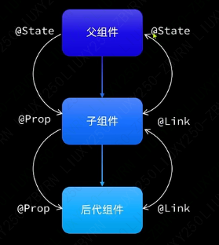

注意，使用@Link，在传递参数变量的时候，需要使用`$`，而不是使用`this`。

```arkts
TaskList({finishTask:$finishTask,totalTask:$totalTask})

@Component
struct TaskList {

  @Link finishTask:number
  @Link totalTask:number
 }
```

#### @Provide和@Consume

@Provide和@Consume可以跨组件提供类似于@State和@Link的双向同步。

> 有点类似于声明全局变量，然后定义使用


```arkts
@Entry
@Component
struct PropPage {
  // 统计信息
  @Provide stat: StatInfo = new StatInfo()

  build() {
    Column({space: 10}){
      // 1.任务进度卡片
      TaskStatistics()

      // 2.任务列表
      TaskList()
    }
  }
}


@Component
struct TaskList {
  // 总任务数量
  @Consume stat: StatInfo
  // 任务数组
  @State tasks: Task[] = []

}
```

#### @Observed和@ObjectLink

@ObjectLink和@Observed装饰器用于在涉及**嵌套对象**或**数组元素为对象**的场景中进行双向数据同步。

##### 以 @State 示例

使用@State，但是对于嵌套类型以及数组中的对象属性无法触发视图更新

```arkts
class Person{
  name: string
  age: number
  gf: Person

  constructor(name: string, age: number, gf?:Person) {
    this.name = name
    this.age = age
    this.gf = gf
  }
}


@Entry
@Component
struct Index {
  @State p: Person = new Person(
    'HuTao',
    18,
    new Person('HuTao2', 13)
  )
  build() {
    Column(){
      Text(`${this.p.gf.name} : ${this.p.gf.age}`)
        .onClick(() => this.p.gf.age)
    }
  }
}
```

##### @Observed和@ObjectLink

- 首先在类上，使用@Observed装饰器

```arkts
@Observed
class Person{
  name: string
  age: number
  gf: Person

  constructor(name: string, age: number, gf?:Person) {
    this.name = name
    this.age = age
    this.gf = gf
  }
}
```

- 使用@ObjectLink，需要将使用的部分封装成组件，如下

```arkts
@Component
struct Child{
  @ObjectLink p: Person

  build(){
    Column(){
      Text(`${this.p.name} : ${this.p.age}`)
    }
  }
}
```

- 调用测试

```arkts
@Entry
@Component
struct Index {
  @State p: Person = new Person(
    'HuTao',
    18,
    new Person('HuTao2', 13)
  )
  build() {
    Column(){
      Child({p: this.p.gf})
        .onClick(() => this.p.gf.age++)
    }
  }
}
```

##### 使用bind()方法

在传递方法`this.handleTaskChange`过程中

```arkts
TaskItem({item: item, onTaskChange: this.handleTaskChange()})
```

其方法，可能随着传递，this指针跟着改变

```arkts
  handleTaskChange(){
    // 1.更新任务总数量
    this.stat.totalTask = this.tasks.length
    // 2.更新已完成任务数量
    this.stat.finishTask = this.tasks.filter(item => item.finished).length
  }
```

为了不改变this，使用bind()方法解决

```arkts
TaskItem({item: item, onTaskChange: this.handleTaskChange.bind(this)})
```

